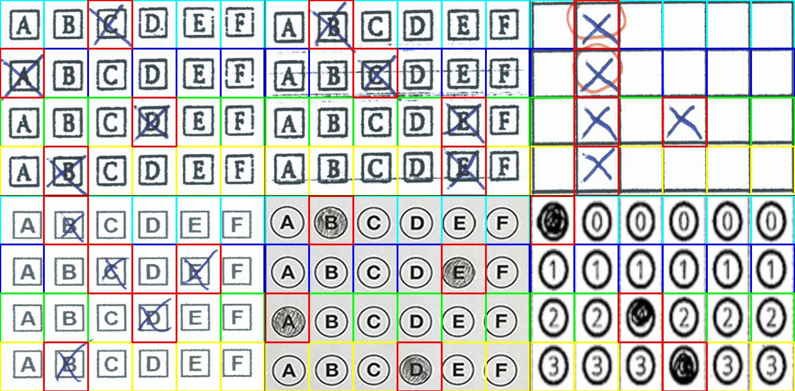

# Multiple Choice Test OMR

### (Work in Progress)

Some days ago, my wife asked me to help her to correct some multiple choice tests and, since I hate to lost my time, I 
spent some hours in order to write a script that automate the data extrapolation.

After googling some information, I found an [interesting article by Adrian Rosebrock](https://www.pyimagesearch.com/2016/10/03/bubble-sheet-multiple-choice-scanner-and-test-grader-using-omr-python-and-opencv/) that talk about this, so I tried his approach  and the result of [first test](test1.py) was good:


This code, basically, convert the image in a black and white version and find all contours with `findContours` and 
`grab_contours`. After that, the contours are filtered and ordered in a matrix.


In many cases worked well, but in other cases did not work, this happened because I used irregular tests:

 - in the first and second case not all checkboxes was found in the first lines and this broke the ordering of all lines
 - in first case some checkboxes have uncompleted borders
 - in the second case the dirty sheet confuses the borders
 - in the third case there are no single border for the each checkbox
 - in the second and fourth case an X exceeds the checkbox borders and this make the aspect ratio of the shape irregular
 - in the sixth case the bubbles have an irregular aspect ratio

The author use very restrictive controls in order to reduce the number of wrong contours, this is possible with clean 
cases:

```
if w >= 20 and h >= 20 and ar >= 0.9 and ar <= 1.1:
    questionCnts.append(c)
```

I tried to do some changes in the code, in particular I allowed a more flexible aspect ratio and I stored the value of 
`countNonZero` in a matrix in order to determine a threshold value and use it for find the checked boxes, this allowed 
to find multiple checked boxes for each line.

I runned the [second test](test2.py) and the results was better:


Assuming that the number of the columns and the number of the rows is know, I tried to skip the part that find the 
contours and I splited the image in the correct number of sectors, the result of [third test](test3.py) was greate:



Well, in the real case, the checkboxes are probably in a large sheet with some text and the approach that search the 
contours probably work well, so I tried and the best [result](images/test4/) of this [fourth test](test4.py) was how I 
expected:


Of course, with bigger checkboxes or in general with a well formed test the results are better, but my scope is to 
create a script that works in all the cases with correct configurations.

In the [test number five](test5.py), I added a bounding box as new parameter and all the results have been perfect.


This solution can be a little bit more complex for the user but, for my purpose, is more flexible.


## Run the tests

In order to run the tests you can download [this folder](.), create a **virtualenv** and install requirements:

```
$ virtualenv .virtualenv --system-site-packages
$ source .virtualenv/bin/activate
$ pip install -r requirements.txt
$ python test1.py
```

The output images will create in the `images/res` folder.


## Conclusions

The code snippet made by Adrian Rosebrock works very well with his own test, but is very specific. By identify some 
parameters the result can be better. The parameters that I identified are:

 - `rows_count = 4`: the number of questions/rows of answers
 - `cols_count = 6`: the number of columns for each question/answer
 - `threshold_multiplier = 1.15`: the multiplier used for each row average value in order to define the threshold value
 - `x, y, w, h = 1215, 822, 306, 229`: the bounding rectangle for the answers

This solution is not universal but works well in my cases and allow to fix the result by changing some parameter.


# Links

 - [Bubble sheet multiple choice scanner and test grader using OMR, Python and OpenCV](https://www.pyimagesearch.com/2016/10/03/bubble-sheet-multiple-choice-scanner-and-test-grader-using-omr-python-and-opencv/)
 - [OMR-Grader](https://github.com/bthicks/OMR-Grader)
 - [Markers](https://opencv-python-tutroals.readthedocs.io/en/latest/py_tutorials/py_imgproc/py_template_matching/py_template_matching.html)
