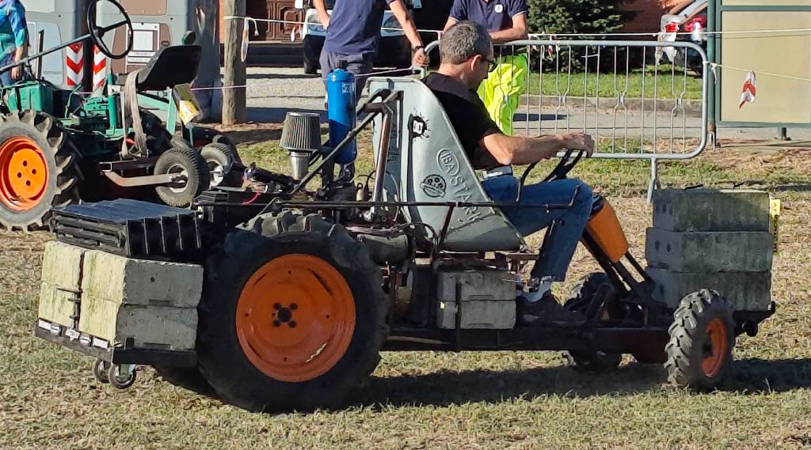
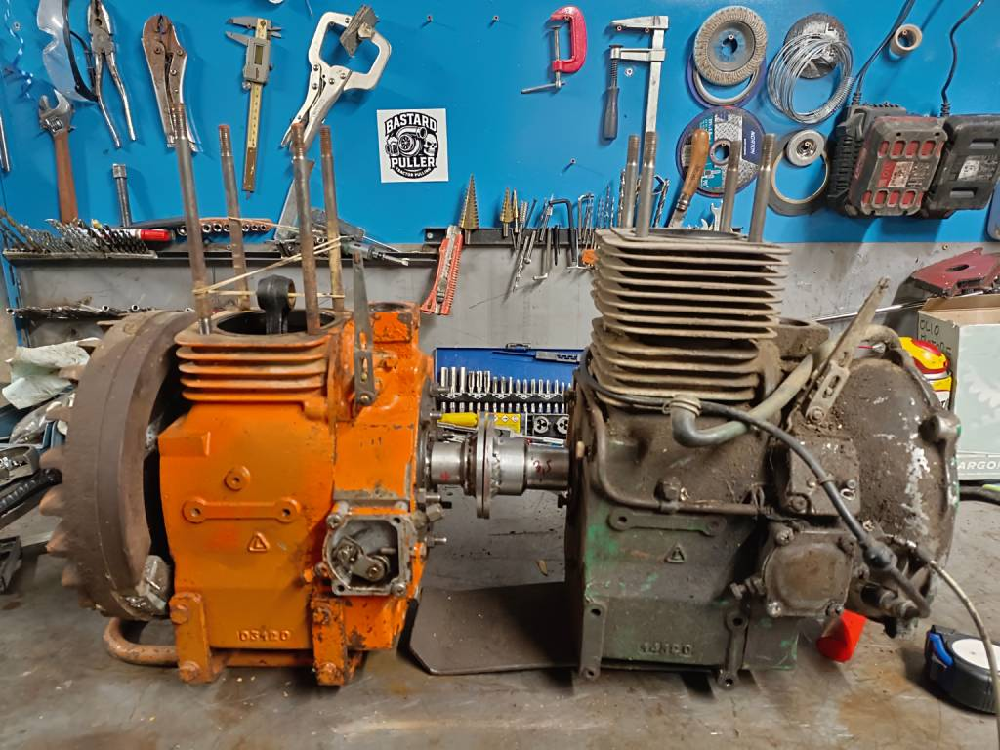
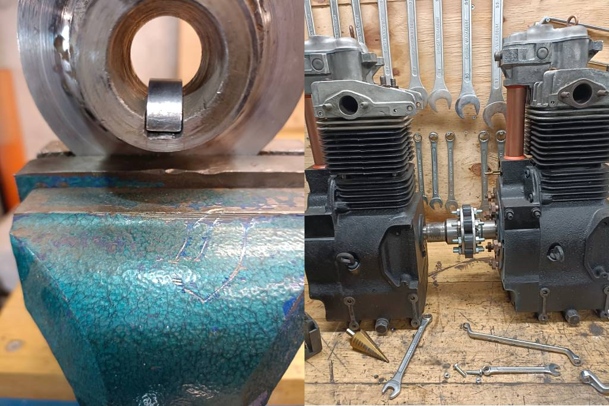
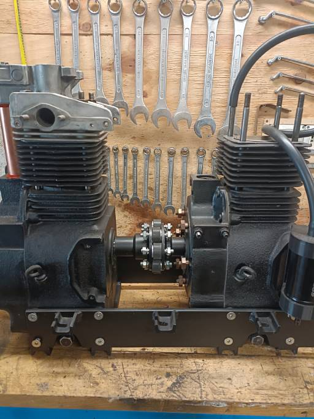
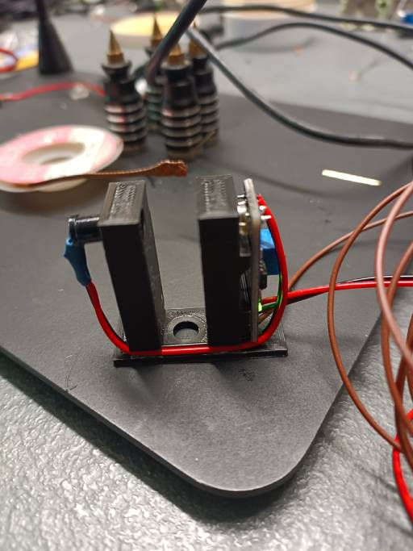
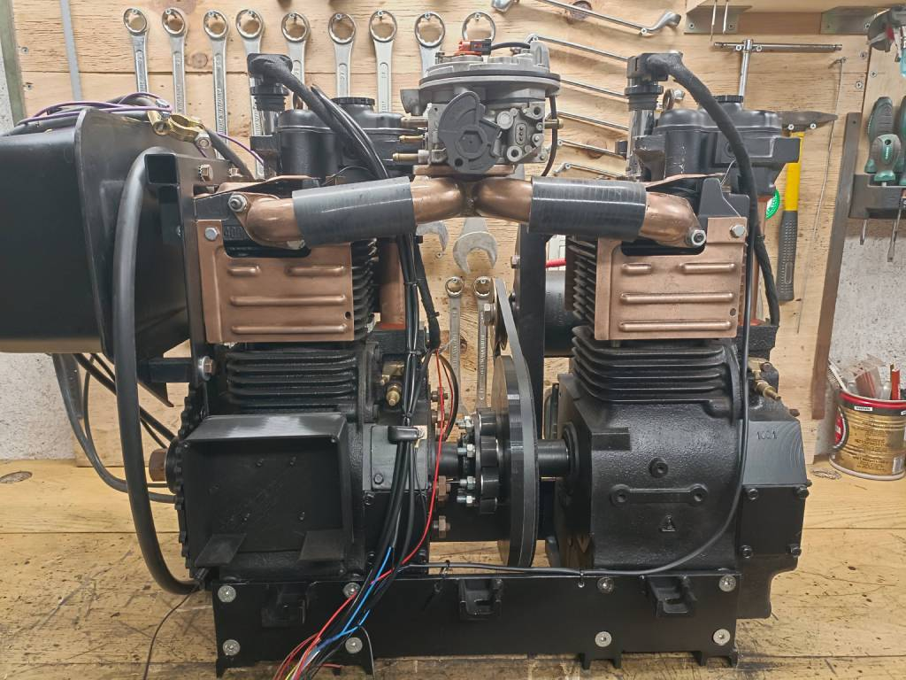
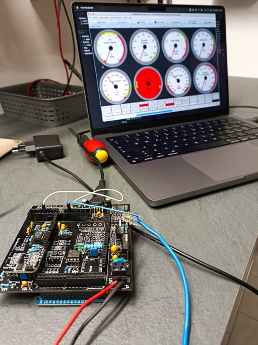
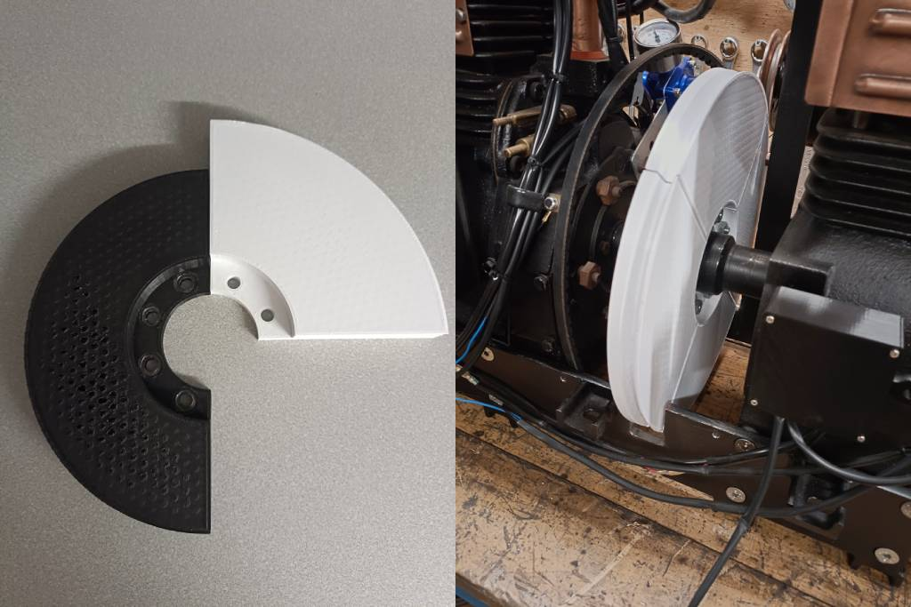
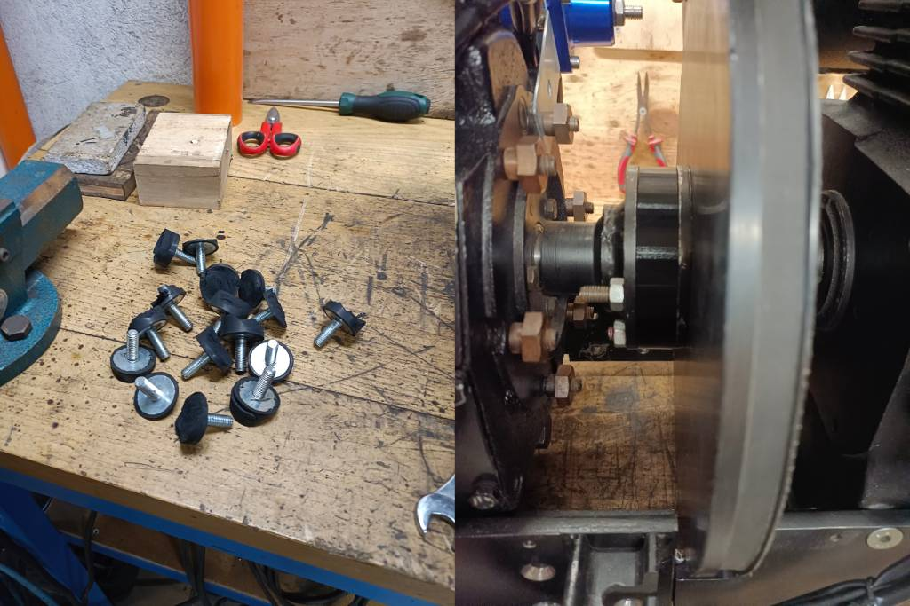
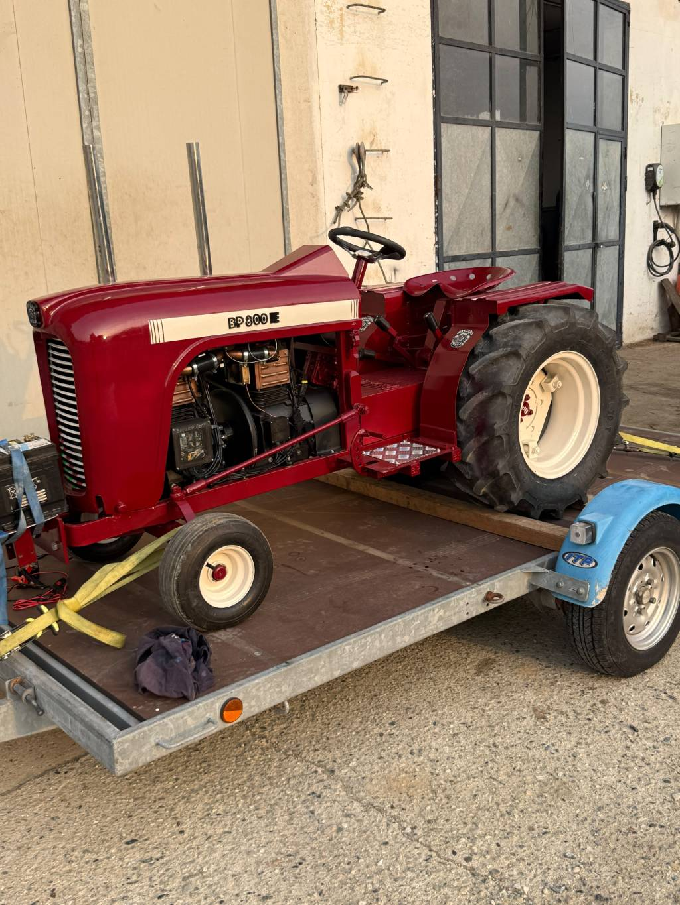

# BP800 i.e.: Come costruire un trattore con motore bicilindrico a iniezione autocostruito

## Introduzione

La mia passione per i motori e l'elettronica ha trovato la sua naturale valvola di sfogo nel 2015, quando ho iniziato ad avvicinarmi alle gare amatoriali di *Coltivatori Pulling*, essenzialmente quello che gli americani chiamano Garden Pulling. Tutto è iniziato dando una mano a un amico a costruire il suo trattorino da traino, ma per quanto mi facesse piacere aiutarlo, realizzare un mezzo proprio è tutta un'altra storia.

Grazie a quella che poi è diventata mia moglie, nel 2017 ho iniziato a costruire il mio primo motocoltivatore dallo stile *cyberpunk*. Usando una carriola come sedile, ho cercato di tirare fuori tutta la potenza disponibile dal motore **Lombardini LAP490** a petrolio, scaricandola a terra tramite il cambio di un **Pasquali 930** appesantito da **320 kg** di cemento e un telaio pensato appositamente per tirare la slitta carica di pesi. Alla prima gara sono riuscito ad assicurarci subito il primo posto.

Negli anni l'ho migliorato sotto il profilo estetico e ho sostituito la benzina pura con una miscela di benzina e cherosene, decisamente più adatta ai rapporti di compressione di un motore nato a petrolio. In seguito ho aggiunto anche una centralina in grado di effettuare l'avviamento da remoto, puramente per il gusto di farlo.

Nel 2018 ho saldato una centralina **Speeduino** con l'intenzione di convertirlo a iniezione, ma per il principio del *"cavallo vincente non si cambia"* alla fine non ho mai portato a termine la modifica.

---

## Il Progetto BP800 i.e.

Un anno fa, chiacchierando con mio cugino — che a sua volta ha realizzato due motocoltivatori —, ci siamo ricordati di avere in garage due motori **Lombardini LA400**. Tra una birra e l'altra è nata l'idea di realizzare un mezzo più ambizioso di tutti i precedenti, alimentato da un doppio **LA400 convertito ad iniezione**.

Ci siamo divisi subito i compiti in modo chiaro: mio cugino si sarebbe occupato principalmente del telaio e della carrozzeria, mentre io mi sarei dedicato principalmente allo sviluppo del motore.

L'obiettivo era realizzare, per quanto possibile, un inedito motore bicilindrico. Dopo aver revisionato completamente entrambe le unità, abbiamo scelto di unirle in linea collegando l'albero lato presa di forza di un motore con l'albero lato volano dell'altro con fasatura a 360°. Poiché l'LA400 ha un volano estremamente pesante, abbiamo deciso di rimuoverlo del tutto, realizzando due mozzi dedicati con flange e attacco conico.

Tramite seghetto e lima abbiamo ricavato manualmente i canali per accogliere i grani di fermo, fondamentali per garantire la sincronizzazione degli alberi. Una volta fissate le flange e portati entrambi i motori al Punto Morto Superiore, abbiamo dato un paio di punti di saldatura provvisori per mantenere l'allineamento perfetto durante l'esecuzione degli 8 fori da 8 mm necessari a unire i due alberi. Fatti i buchi, abbiamo rimosso le saldature di servizio e installato 8 silentblock per collegare gli alberi.

Con gli alberi collegati siamo passati alla struttura per unire i due monoblocchi. Abbiamo sfruttato i 4 fori laterali e i 4 inferiori di ciascun motore, praticando i relativi buchi su due lame in acciaio da 80x6 mm, per poi unirle da sotto mediante un profilato a C estremamente robusto.

---

## Conversione EFI: Sensoristica e Attuatori su Speeduino

Ottenuto il blocco unico, abbiamo iniziato a lavorare sulla conversione a iniezione elettronica. La centralina Speeduino richiede una serie di sensori e attuatori per poter gestire la carburazione e l'accensione, ma il più importante è sicuramente il sensore di giri dell'albero motore.

Per la lettura dei giri non è sufficiente conoscere la semplice velocità di rotazione: la centralina deve individuare con precisione la posizione angolare dell'albero per sapere dove si trova il pistone. Per fare questo si usa solitamente una ruota fonica con un dente mancante.
Ho quindi realizzato un nuovo mozzo flangiato su cui abbiamo posizionato una corona da 48 denti, spianando le punte al tornio.

Inizialmente ho testato alcuni sensori ad **effetto Hall** con uscita digitale (dato che Speeduino richiede un segnale digitale), ma purtroppo non supportavano frequenze elevate: a 5000 giri/min con 48 denti parliamo di circa 4 kHz.

I **sensori VR** generano invece corrente alternata e avrebbero richiesto un circuito di condizionamento aggiuntivo, così ho preferito optare per un sensore ottico.

Ho modificato un **sensore di prossimità IR** stampando un supporto in 3D su misura per posizionare il ricevitore davanti al LED emettitore, facendo passare i denti della corona nel mezzo.

Essendo gli LA400 raffreddati ad aria, non era possibile usare un classico sensore per l'acqua. Ho risolto utilizzando due **termistori NTC** con curva B3950, montati su rondelle M10 e pizzicati sotto la lamiera che convoglia l'aria sulla testata. Collegandoli assieme, la centralina legge la resistenza più bassa, ossia la temperatura più alta tra le due testate.

Per l'alimentazione, il modo più semplice di convertire un bicilindrico ad iniezione è usare un sistema **Single Point Injection** (SPI). Abbiamo recuperato un corpo farfallato completo da un motore **Fiat Fire**, che integra già l'iniettore, il regolatore di pressione, il sensore temperatura aria, il TPS e il motore passo-passo per il minimo.

Abbiamo posizionato il corpo farfallato esattamente al centro tra i due motori, così da poter realizzare un collettore con i tubi di lunghezza identica e ridurre al minimo le differenze in aspirazione.

Per l'alimentazione del carburante abbiamo montato una pompa della benzina CarBole da 125 PSI e un regolatore di pressione esterno; al momento, però, usiamo il regolatore esterno solo come manometro di controllo della pressione, affidandoci per la regolazione reale a quello originale integrato nel corpo farfallato.

Infine, per l'accensione va considerato che Speeduino non è in grado di pilotare direttamente una bobina ad alta tensione. Abbiamo scelto quindi due bobine NGK U5002 con modulo d'accensione e pipetta integrati, che richiedono semplicemente un segnale digitale per scoccare la scintilla. Non è stato semplice reperire la documentazione elettrica, ma alla fine siamo risaliti al cablaggio corretto.

Scegliendo una configurazione *waste spark* (scintilla persa) come nel motore originale, abbiamo potuto pilotare entrambe le bobine sfruttando un'unica uscita della centralina.

---

## Configurazione Software e Test a Banco

Effettuato il primo setup hardware, siamo passati alla configurazione software della centralina. Abbiamo caricato l'ultima versione del firmware e, tramite TunerStudio, abbiamo impostato gli *Engine Constants* e i *Trigger Settings*, calibrato i sensori di temperatura con le relative curve e fatto un test della portata dell'iniettore a diversi voltaggi.

Durante queste prime prove è emerso un disallineamento sul sensore della tensione della batteria letto dalla centralina: per risolverlo abbiamo applicato una correzione direttamente nel codice sorgente del firmware, flashando poi una versione custom sulla centralina.

Risolto questo aspetto, abbiamo testato tutti i sensori e gli attuatori a banco, verificando che la parte elettronica rispondesse a dovere.

---

## Avviamento, Imprevisti Meccanici e Corsa contro il Tempo

Essendo il quarto motocoltivatore che preparavamo, avevamo le idee abbastanza chiare sull'avviamento: avremmo usato il **dinamotore dell'Ape TM703** già impiegato in passato. Non eravamo però certi che avesse abbastanza forza per trascinare un bicilindrico.

Abbiamo stampato una puleggia di test in 3D da 22 cm, ma lo sforzo richiesto era eccessivo e si è reso necessario ingrandirla a 29 cm. Per far entrare la nuova puleggia abbiamo dovuto modificare il telaio inferiore che unisce i motori: ne abbiamo approfittato per riprogettarlo in due sezioni unibili tramite 6 bulloni M8, consentendo così di separare i due monoblocchi in modo molto più agevole.

Una volta rimontato tutto, abbiamo rifatto l'impianto elettrico da zero. La difficoltà maggiore è stata trovare i connettori originali del corpo farfallato Fire. Inoltre, sulla centralina avevo sfortunatamente previsto un connettore a 2x20 PIN simile a quello dei vecchi **cavi IDE per PC**, molto difficile da crimpare senza l'apposito cavo flat. Abbiamo quindi riadattato un cavo esistente, saldando i minuscoli fili interni sui cavi di sezione maggiore dell'impianto.

Al momento dei primi avviamenti sono iniziati i problemi. La puleggia di test stampata in 3D in 4 pezzi ha agganciato il telaio ed è andata letteralmente in mille pezzi. L'abbiamo subito riprogettata e realizzata in pezzo unico di PVC, tornita dal pieno.

Risolto il primo intoppo si sono tranciati gli 8 silentblock che univano gli alberi motore. Eravamo consapevoli che fosse un punto critico, ma speravamo tenesse più a lungo. Li abbiamo sostituiti con 8 bulloni passanti M8 in classe 8.8, inserendo un distanziale stampato in 3D che ha il solo compito di lasciare un minimo grado di libertà alle due flange.

Superate le rotture meccaniche, il motore continuava a non andare in moto. Abbiamo verificato la regolazione del PMS tramite pistola stroboscopica, operazione complessa perché misurare manualmente i gradi di anticipo o ritardo per correggere il posizionamento del sensore ottico richiede molta precisione, così da garantire che la centralina calcoli l'iniezione sulla reale posizione dell'albero.

Nonostante la fase sembrasse corretta, il motore accennava a partire ma si spegneva subito. Durante i tentativi il computer si scollegava continuamente dalla centralina, si è bruciato il driver del motore passo-passo che regola il minimo e la carburazione risultava costantemente troppo grassa.

A soli 4 giorni dalla gara, senza più tempo per fare prove a banco, abbiamo deciso di montare il motore sul motocoltivatore così com'era, sperando che l'assemblaggio completo ci aiutasse a capire cosa non andasse. Guardando il sistema da questa nuova prospettiva ci siamo accorti che l'iniettore a volte rimaneva incantato aperto e altre volte non spruzzava affatto. Il sospetto è caduto subito sulle interferenze elettromagnetiche. Abbiamo sostituito le candele B7HS originali con candele resistive BR7HS e finalmente il motore ha iniziato a girare.

Mancavano due giorni alla gara. Il motore non teneva il minimo perché si era bruciato un secondo driver del passo-passo, ma speravamo fosse solo questione di affinare le mappe. Abbiamo passato l'intera ultima giornata a modificare le mappe e testare diverse modifiche ai cablaggi, ma il risultato migliore è stato soltanto una discreta stabilità al minimo.

Quando sono emersi anche dei problemi di trascinamento sulla frizione nell'accoppiamento con il telaio, abbiamo preso la decisione finale: andare alla gara con i mezzi vecchi e portare il nuovo **BP800 i.e.** solo per esposizione.

L'interesse e la curiosità mostrati dal pubblico durante la manifestazione sono stati enormi, dandoci una gran carica per continuare lo sviluppo.

---

## Analisi dei Problemi e Interventi Futuri

Dopo molte prove siamo giunti alla conclusione che una serie di errori di progettazione elettrica hanno portato la centralina ad avere forti instabilità.

Sospettiamo che il dinamotore dell'Ape TM703 sia una delle fonti principali di disturbo elettromagnetico. L'impianto elettrico non è stato realizzato con una distribuzione a stella e le masse dei sensori non partono direttamente dal connettore della centralina. Il case di quest'ultima è stampato in 3D, privo di schermature metalliche per gli impulsi EM. Inoltre, il cavo del sensore di giri — il segnale in assoluto più critico — compie un percorso lungo, con fili di piccola sezione e non schermati. Per finire, il connettore di tipo IDE si è rivelato un punto estremamente sensibile ai segnali parassiti.

Per risolvere definitivamente i problemi in vista delle prossime uscite, abbiamo pianificato una serie di interventi mirati:

Per prima cosa abatteremo le interferenze del dinamotore collegando un condensatore da 1 µF - 450V tra la massa e il polo positivo dello stesso. Per eliminare i picchi di tensione che si generano al rilascio del teleruttore d'avviamento, inseriremo due diodi 1N4007 in parallelo ai pin della bobina di comando. Aggiungeremo inoltre un convertitore DC-DC (8V-40V a 12V) per garantire alla centralina un'alimentazione perfettamente stabile ed evitare reset anche durante le cadute di tensione in fase di spunto.

Rifaremo completamente l'impianto elettrico adottando uno schema a stella, separando le masse degli attuatori da quelle dei sensori, che convergeranno tutte direttamente sul connettore della centralina. Per il sensore di giri utilizzeremo un cavo schermato con maglia messa a terra lato centralina, riducendo la lunghezza del percorso e passandola lontano da fonti di radiazione elettromagnetica.

Infine, salderemo da zero la scheda della centralina: utilizzeremo un connettore di tipo automotive saldato direttamente sulla PCB con cavi di sezione adeguata, il tutto racchiuso in un nuovo box a due strati dotato di una schermatura in rame collegata a massa, così da creare una vera e propria gabbia di Faraday contro le interferenze estrene.

Se siete interessati alle novità potete seguire il progetto su [bastardpuller.it](https://www.bastardpuller.it/), su [YouTube](https://www.youtube.com/@bastardpuller) o su [Instagram](https://www.instagram.com/bastardpuller/).
