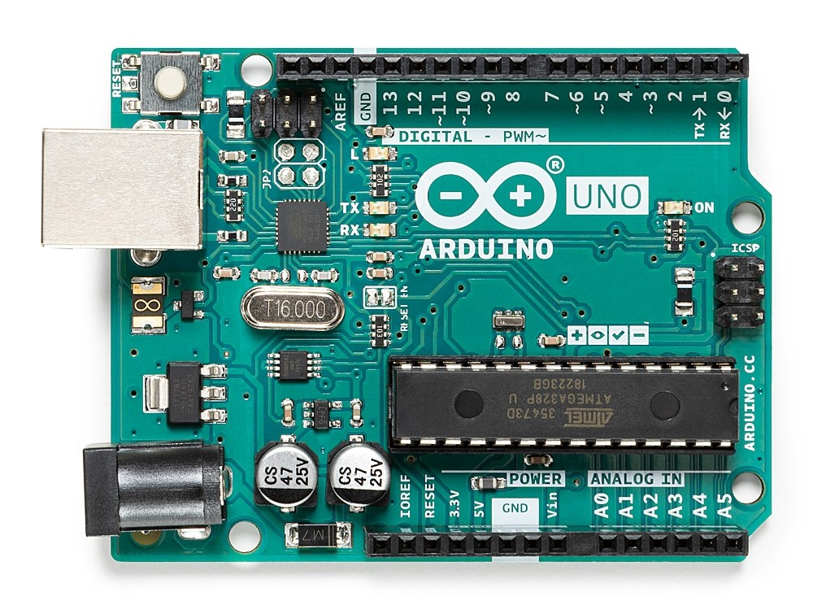

# Introduzione ad Arduino

**Arduino** è un progetto che racchiude svariate scheda open-source per la prototipazione che sono basate su microcontrollori [Atmel AVR](https://it.wikipedia.org/wiki/Atmel_AVR) a 8 bit.

La più conosciuta ed iconica è la scheda [Arduino Uno](https://store.arduino.cc/arduino-uno-rev3) che è composta da un microcontrollore [ATmega328P](https://ww1.microchip.com/downloads/en/DeviceDoc/Atmel-7810-Automotive-Microcontrollers-ATmega328P_Datasheet.pdf) rimovibile in package [DIP](https://it.wikipedia.org/wiki/Dual_in-line_package).

Il progetto Arduino nasce ad Ivrea (Italia) nel 2005, la grande diffusione di queste schede è dovuta all'estrema semplicità che le caratterizza e che permette di creare i propri progetti in pochi passi; questa semplicità è data dal bootloader, dall'IDE e dalle caratteristiche della scheda, come l'interfaccia USB, i regolatori di tensione da 3.3V e 5.0V, gli header di espansione e il jack di alimentazione.

### Arduino IDE

[Arduino IDE](https://www.arduino.cc/en/main/OldSoftwareReleases) è l'integrated development environment ufficiale di Arduino, ovvero il software integrato per lo sviluppo. Sebbene non sia indispensabile per interfacciarsi con la scheda, semplifica molto l'esperienza con Arduino grazie a un'interfaccia semplice ed intuitiva che integra tutte le componenti necessarie.

### Arduino Bootloader

Il bootloader è il vero cuore di Arduino, grazie al quale gli utenti possono caricare i loro programmi sulla memoria dell'AVR semplicemente collegandosi alla porta USB posizionata sulle schede Arduino.

Essendo il bootloader un programma preinstallato nella memoria del microcontrollore, occupa spazio; per questo Arduino permette, usando un ISP programmer esterno, di caricare in memoria programmi utilizzando l'intero spazio disponibile; con la stessa tecnica e anche possibile caricare il bootloader su un AVR dal quale era stato cancellato.

### Arduino Shields

Sullo [store ufficiale](https://store.arduino.cc/) e su vari portali, oltre alle schede Arduino sono presenti molti shield, ovvero moduli di espansione che permettono di aggiungere nuove funzionalità tramite gli appositi header.

### Arduino Community

L'enorme community che si è creata attorno al progetto Arduino è l'elemento che completa l'ecosistema.

Sul [forum Arduino](https://forum.arduino.cc/index.php), e non solo, è possibile trovare l'aiuto degli utenti e molti progetti, da quelli più semplici per imparare l'elettronica a quelli più elaborati di domotica, robotica e automazione.

### Starter Kit

Per fare i primi esperimenti con Arduino spesso è necessario reperire alcuni elementi aggiuntivi, come: *LED*, *resistenze*, *condensatori*, *potenziometri*, *motori* e *servomotori*.
Reperire tutti questi componenti può essere complicato, per questo sullo store Arduino, e su altri store, sono disponibili diversi kit che contengono tutto il necessario per sperimentarsi fin da subito a realizare piccoli circuiti.

### Schede Standard

Ci sono svariate versioni di Arduino a seconda del progetto e dello scopo per cui le si vuole utilizzare:

| Scheda | Microcontrollore | Porta | Velocità clock | Digital input/output | Voltaggio | Altro |
|---|---|---|---|---|---|---|
| [Arduino Uno](https://store.arduino.cc/arduino-uno-rev3) | [ATmega328P](https://ww1.microchip.com/downloads/en/DeviceDoc/Atmel-7810-Automotive-Microcontrollers-ATmega328P_Datasheet.pdf) | USB Type-B | 16 MHz | 14 | 5.0V | UART, ISP, SPI, I2C |
| [Arduino Leonardo](https://store.arduino.cc/arduino-leonardo-with-headers) | [ATmega32U4](https://ww1.microchip.com/downloads/en/DeviceDoc/Atmel-7766-8-bit-AVR-ATmega16U4-32U4_Datasheet.pdf) | Micro USB | 16 MHz | 20 | 5.0V | UART, ISP, SPI, I2C |
| [Arduino Mega 2560](https://store.arduino.cc/arduino-mega-2560-rev3) | [ATmega2560](http://ww1.microchip.com/downloads/en/DeviceDoc/Atmel-2549-8-bit-AVR-Microcontroller-ATmega640-1280-1281-2560-2561_datasheet.pdf) | USB Type-B | 16 MHz | 54 | 5.0V | 4 UART, ISP, SPI, I2C |
| [Arduino Nano Every](https://store.arduino.cc/arduino-nano-every) | [ATMega4809](http://ww1.microchip.com/downloads/en/DeviceDoc/ATmega4808-4809-Data-Sheet-DS40002173A.pdf) | Micro USB | 20MHz | 14 | 5.0V | UART, SPI, I2C |
| [Arduino Micro](https://store.arduino.cc/arduino-micro) | [ATmega32U4](https://ww1.microchip.com/downloads/en/DeviceDoc/Atmel-7766-8-bit-AVR-ATmega16U4-32U4_Datasheet.pdf) | Micro USB | 16 MHz | 20 | 5.0V | UART, ISP, SPI, I2C |

**Arduino Uno** è la scheda ideale per iniziare, ha un *costo contenuto* ed è possibile sostituire il microcontrollore in caso di problemi.

**Arduino Mega 2560** è l'ideale per progetti che necessitano di *molti input/output*.

**Arduino Nano Every** e **Arduino Micro** permettono di realizzare progetti compatti grazie alle loro *dimensioni ridotte*.

### Schede Avanzate

Oltre a quelle standard negli anni sono nate svariate board che aggiungono altre funzionalità (WiFi, Bluetooth, ecc), aumentano le prestazioni o permettono di sperimentare con nuove piattaforme.

Qui sotto ne elencherò alcune:

| Scheda | Microcontrollore | Porta | Velocità clock | Digital input/output | Voltaggio | Altro |
|---|---|---|---|---|---|---|
| [Arduino UNO WiFi](https://store.arduino.cc/arduino-uno-wifi-rev2) | [ATmega4809](http://ww1.microchip.com/downloads/en/DeviceDoc/ATmega4808-4809-Data-Sheet-DS40002173A.pdf) | USB Type-B | 16 MHz | 14 | 5.0V | UART, SPI, I2C, WiFi, BLE, IMU |
| [Arduino Due](https://store.arduino.cc/arduino-due) | [Atmel SAM3X8E ARM Cortex-M3](http://ww1.microchip.com/downloads/en/DeviceDoc/Atmel-11057-32-bit-Cortex-M3-Microcontroller-SAM3X-SAM3A_Datasheet.pdf) | Micro USB | 84 MHz | 54 | 3.3V | 4 UART, SPI, I2C, USB OTG, 2 TWI, JTAG |
| [Arduino Nano 33 BLE](https://store.arduino.cc/arduino-nano-33-ble) | [nRF52840 ARM Cortex-M4](https://infocenter.nordicsemi.com/pdf/nRF52840_PS_v1.1.pdf) | Micro USB | 64MHz | 14 | 3.3V | UART, SPI, I2C, BLE, IMU |
| [Arduino Nano 33 IoT](https://store.arduino.cc/arduino-nano-33-iot) | [SAMD21 ARM Cortex-M0](https://ww1.microchip.com/downloads/en/DeviceDoc/SAM_D21_DA1_Family_DataSheet_DS40001882F.pdf) | Micro USB | 48MHz | 14 | 3.3V | UART, SPI, I2C, WiFi, BLE, IMU |
| [Arduino Zero](https://store.arduino.cc/arduino-zero) | [SAMD21 ARM Cortex-M0](https://ww1.microchip.com/downloads/en/DeviceDoc/SAM_D21_DA1_Family_DataSheet_DS40001882F.pdf) | Micro USB | 48 MHz | 20 | 3.3V | 2 UART, SPI, I2C, EDBG |
| [Arduino Yún](https://store.arduino.cc/arduino-yun-rev-2) | [ATmega32U4](https://ww1.microchip.com/downloads/en/DeviceDoc/Atmel-7766-8-bit-AVR-ATmega16U4-32U4_Datasheet.pdf) / [Atheros AR9331](https://www.openhacks.com/uploadsproductos/ar9331_datasheet.pdf) | Micro USB | 16MHz / 400 MHz | 20 | 5.0V / 3.3V | UART, ISP, SPI, I2C / Linux, Ethernet, Micro-SD, USB 2.0 host |

Infine, la serie di schede **Arduino MKR** rispondono ad ulteriori esigenze specifiche (*FPGA*, *Narrowband*, *LoRa*, *GSM*, *Sigfox*, ecc).

### Schede Compatibili o Fatte in Casa

Essendo Arduino un progetto open-source, esistono diverse **schede clone** o **varianti** delle originali a prezzi estremamente competitivi.

La scheda [Acelex Uno r3](https://it.aliexpress.com/item/1005001555301794.html) vi permette di iniziare a sviluppare con Arduino spendendo meno di 3€;
a differenza di Arduino Uno r3, utilizza una porta micro USB e un più economico chip [CH340G](https://cdn.sparkfun.com/datasheets/Dev/Arduino/Other/CH340DS1.PDF) come interfaccia USB to serial.

Esistono [varianti di Arduino Nano](https://it.aliexpress.com/item/33013146682.html) basate su CH340G e ATmega328P che sono reperibili a poco più di 1.5€.

Una delle varianti più famose è la scheda [Node MCU](https://it.aliexpress.com/item/1005001621511978.html) che è basata sul modulo WiFi e BLE [ESP8266](https://www.espressif.com/sites/default/files/documentation/0a-esp8266ex_datasheet_en.pdf).

Se sei interessato ad Arduino probabilmente ti piace sperimentare e costruire; realizzare una versione personalizzata di Arduino non è difficile, vedremo più avanti quali sono le componenti dell'originale e come realizzarne una partendo da una MCU.
